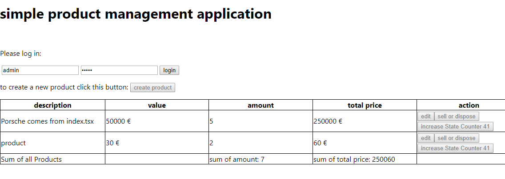

This project was bootstrapped with [Create React App](https://github.com/facebook/create-react-app).

## Available Scripts

In the project directory, you can run:

### `npm start`

"start": "react-scripts start"

## Typescript and Redux Framework

This is an example app to show how to build a scalabe singele page progressive web app with typescript, redux and react

react is as loosly coupled as possible to the concept, and could be easily repaced by native WebComponents

https://developer.mozilla.org/de/docs/Web/Web_Components

## preparation: 

cd m3-redux-statemanagement
npm install

## Iteration 1

First look at the Index.tsx and App.tsx files. A lot of things have changed because we want to manage our states with redux.
Take your time to understand the adaptations. You can also have a look at our framework we build for this lab. We provided
in the folders framework, reducer and state a lot of functions you can use for your application. Those functions are part of a
framework we created. Don't worry, you don't need to comprehend every detail of this framework.
You just need to know that we provide "get" functions for all states and that all reducer functions are defined in our appReducer file.
After you got an overview of the code and framework, change all variable and object names from asset to product. This change doesn't only make sense
because we want to build a shopping card. It will force you to look more precise to the code before starting to extending it.
You will see, that you will need to change every important file and typescript will tell you still need to change.

After you finished renaming everything add two new columns. One for the amount of Products and another for the total price of the product. 

## Iteration 2

For the next iteration, we want to add a new component. This component should sum up the amount and total price of all our products.
This means, if you change something in one product, you should also see a difference in the sum component. 
Add in our components folder the new component and name it SimpleSum. Hint: Don't create a new action. For this iteration, it's enough
to extend the existing actions. Don't forget to add and use new states in our appState file. We want to use Redux so that we don't need
to use a state lift up. You should be able to get all states in our appState file with following get functions:
* window.CS.getBMState()
* window.CS.getUIState()

You will also need to add new States to the appState file.

## Iteration 3

For the third iteration, we want to implement a fake log in and log out function. This login/logout function should just disable all buttons on our page.
If you look at our User Interface states (UI at appState.ts) you will see that we already defined a state for our login.
We want to use and work with this state with a new component. Add in our components folder the new component and name it SimpleLogin.
Our SimpleLogin will need new reducer functions in our appReducer file. We want to create a new action for Login and one for logout. For the validation
you can simply add a User object with the properties "username" and "password" in our Business Interface (BI at appState.ts). We need to do this because in this exercise
we don't use any Database. 

